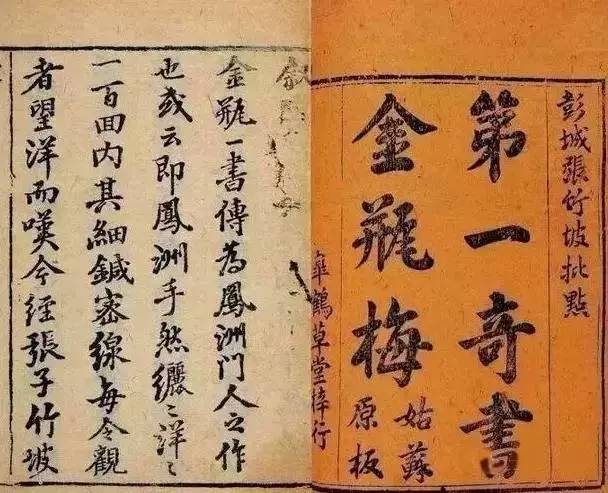
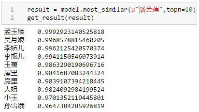

分析《金瓶梅》
========
所用到的库，jieba，gensim，用的版本是网上下载的无删节“崇祯本”，好像也不全，比如武大郎死后做法事时候的一段这个版本就没有：
* 『只听见妇人在房里颤声柔气，呻呻吟吟，哼哼唧唧，恰似有人在房里交姤，于是推洗手，立住了脚，听了起来。只听妇人嗽声呼叫西门庆：“达达，你休只顾搧打到几时，只怕和尚来了听见，饶了奴罢。”西门庆道：“你且休慌，我还要在盖子上烧一下儿哩（交欢时的荤话，不少版本多删去）！”不想都被这个秃厮听了个不亦乐乎。落后众和尚都到齐了，吹打起法事来，一个传一个，都知道妇人有汉子在屋里，不觉都手之舞之，足之蹈之。待到佛事将完，潘金莲换了一身艳服，在帘里与西门庆两个并肩而立，看着和尚化烧灵座。和尚看到帘子里的汉子，想起起先听到的那些勾当，只个乱打鼓 “扌扉” （同捭相近，张开，四川方言，键盘打不出来）钹不住，被风把长老的僧伽帽刮在地上，露见青旋旋光头，不去拾，只顾 扌扉 钹打鼓，笑成一团』

难点
========
主要还是分词，jieba是通用性的，对于古汉语（虽然还算是白话文）没有针对性，所以缺省下效果很不好。增加分词准确性主要通过：

* stopwords，过滤之乎者也这些虚词和常用的虚词，比如“恨不能 哼 哼唷 后来 乎 呼 呼哧 忽然”
* 通过使用用户字典，我把金瓶梅的下列专门用户放进字典避免分错：
    * 主要人物（李瓶儿，潘金莲，吴月娘，陈敬济），
      http://www.360doc.com/content/15/0227/15/3328689_451241184.shtml
    * 职业（道士，府尹，秀才，喇嘛），
    * 物件（舍利，茄袋，香囊，银托子），
    * 习俗（头七，会亲，拜见钱，猜枚），
      http://www.360doc.com/content/17/1202/23/50407527_709377774.shtml
    * 当然还有一些色情的用语（勉铃，吮咂，蛙口，牝户）
* 过滤jieba处理后的单字节，主要是动词（打，骂，追，叫），对分析关系帮助不大，反而形成干扰
* 还有就是一个人物在文中不同的称呼要处理，比如吴月娘，月娘，大娘，因为西门庆有六个老婆，她们互相之间会称呼二姐，三姐，四姐，六妹之类的，要把这些称呼转换成对应的人物，不然结果不准确，我并没有在程序里处理，而是直接在 vi 里用search/replace处理掉了，还有就是“达达”，主要是对西门庆的昵称（通常在苟且之时），但我不确定是不是全部的“达达”都是指西门庆，因为我也没仔细去查找，所以没有替换
* 另外一个难点就是“你我他”的称呼，因为“你”到底指谁要通过上下文来判断，暂时不知道如何处理

结果
========

* <b>原来吴月娘在小说中的比重比潘金莲还大</b> 
（注：大姐就是西门大姐，西门庆的女儿，四娘就是贲四娘子，小玉和玉箫是吴月娘的丫头，其余5人皆为西门庆的妻妾）
* 要对小说事前做很多预处理，不对小说有所了解就没法做预处理，这也就是说没法做全自动化，不然就是 garbage in garbage out，其实这也是人工智能要面对的，你需要一个行业专家才能具体落地解决方案，不能期望一个算法，再扔一堆数据就期望出来好结果

后续
========
* 建立一个多义词词典，因为对同一个人会存在不同的称呼，比如{乾隆：朕，陛下，万岁爷，圣上，老佛爷，十全老人，乾隆爷}在一部小说里都指同一个人，如果不做整合统计就会不准确，但是如果一部小说里写清朝几代，那么（朕，陛下，圣上）就可能指几个人比如顺治，乾隆，雍正，这就是复杂的地方
* 通过深度学习，用LSTM之类的方法，和传统的方法比较一下结果

未完待续
========
